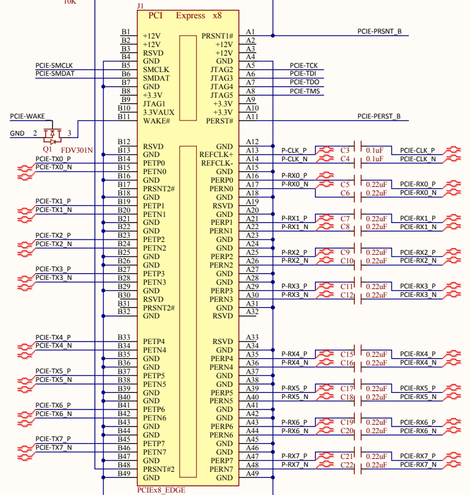
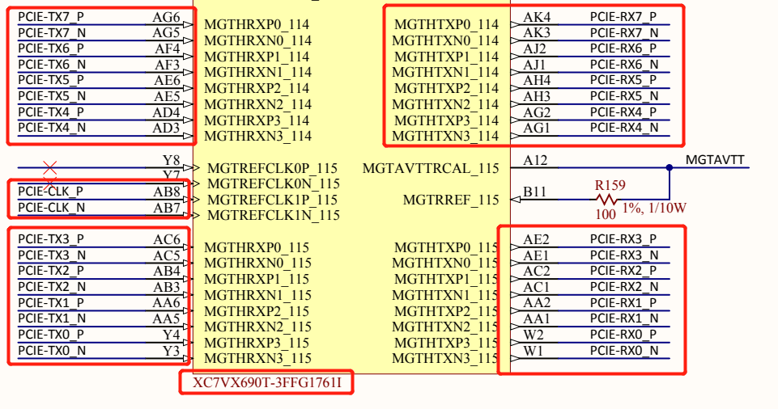
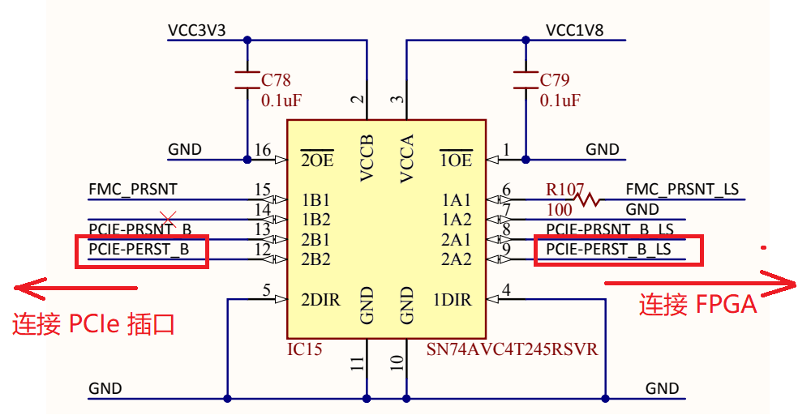
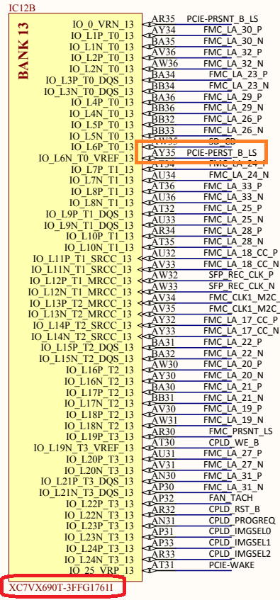

# FPGA PCIe 引脚分配

拿到一块 Xilinx FPGA 板子，首先要关注的是如何在 Vivado 中进行 PCIe 引脚分配。

有很多捷径：一些靠谱的开发板商 (比如 Digilent) 会提供很全面的约束文件 (.xdc) ，我们只需要把它加入 Vivado 工程，然后注释掉其中我们用不到的引脚分配即可。例如 [NetFPGA](https://digilent.com/reference/programmable-logic/netfpga-sume/start) 的约束文件在这里下载: https://digilent.com/reference/_media/reference/programmable-logic/netfpga-sume/sume_master.zip 。

但很多时候 (尤其是非官方的板子) 并不提供这些，我们就要用**一种通用的方法** —— **阅读开发板 PCB 原理图** (schematic) ，自己编写 .xdc 进行引脚分配。

　

## 找到 PCIe 插口元件

以  [NetFPGA](https://digilent.com/reference/programmable-logic/netfpga-sume/start) 为例，在 https://digilent.com/reference/_media/reference/programmable-logic/netfpga-sume/netfpga-sume_sch.pdf 下载它的原理图。

在原理图上，你可以找到该板子上的所有元件。首先我们要找到 **PCIe 插口** 这个元件（也就是PCIe金手指，用来插到计算机主板的PCIe插槽里）。如 **图1** 就是 **PCIe插口** 在原理图里的样子。我们要重点关注其中的：

- TX (transmit) 和 RX (receive) 两个方向的 PCIe **差分信号线** 
- 一对**差分时钟线** (REFCLK)
- 一根**复位线** (PERST#)


|               |
| :----------------------------------------------------------: |
| **图1** : NetFPGA 原理图中的 PCIe 插口元件 (俗称金手指) 。（摘自 NetFPGA 原理图第1页） |

### 差分信号线

从**图1**可知，这是一个 PCIe x8 的插口，因为两个方向各有 8 对差分信号线。在**图1** 左侧我们看到：

- TX 方向第 0 对差分线，在图中的网络名为 `PCIE-TX0_P` 和 `PCIE-TX0_N` ；
- TX 方向第 1 对差分线，在图中的网络名为 `PCIE-TX1_P` 和 `PCIE-TX1_N` ；
- 以此类推……，共有 8 对 TX 差分线。

在**图1** 右侧我们看到：

- RX 方向第 0 对差分线，在图中的网络名为 `PCIE-RX0_P` 和 `PCIE-RX0_N` ；
- RX 方向第 1 对差分线，在图中的网络名为 `PCIE-RX1_P` 和 `PCIE-RX1_N` ；
- 以此类推……，共有 8 对 RX 差分线。

### 差分时钟线

PCIe 规定了一对差分参考时钟信号 (REFCLK)，该时钟由 RC (例如计算机主板) 提供给 EP (FPGA) ，用来驱动 EP 内的 PCIe core 工作。在**图1** 中的网络名为 `PCIE-CLK_P` 和 `PCIE-CLK_N` 。

### 复位线

PCIe 规定了一根复位信号 (PERST#)，该复位由 RC 提供给 EP ，用来复位系统。在**图1** 中的网络名为 `PCIE-PESET_B` 。

　

## 区分 TX 和 RX 的方向

**注意!!!** 一个非常重要的事是搞清楚信号线 TX (transmit) 和 RX (receive) 方向是相对于谁而言的。RC (主机) 的 TX 对于 EP (FPGA) 来说是 RX ； RC 的 RX 对于 EP 来说是 TX 。画原理图的人可能根据自己的喜好给信号线起名，有的人把 RC 的 TX 叫 TX ，有的人把 EP 的 TX 叫 TX ，容易造成阅读者的混淆。

一种靠谱的区分方法是看 PCIe 插口元件上的引脚排布：PCIe 参考时钟 (REFCLK) 和复位 (PERST#) 一定和 RC 的 RX (EP 的 TX) 处于同侧。

例如在**图1**中，参考时钟和复位在右侧，则右侧这些差分信号线都是 RC 的 RX ，也就是方向是从 FPGA 到计算机主板。而左侧这些差分信号就都是 RC 的 TX ，也就是方向是从计算机主板到 FPGA 。

显然，画这个原理图的人的习惯是以 RC 的视角出发来命名 TX 和 RX 。而我们在 FPGA 开发中习惯反过来——以 FPGA 的视角来命名 TX 和 RX 。后文编写 约束文件 (.xdc) 时要注意这一点。

> :point_right: RX 和 TX 的视角问题经常让很多开发者 “阴沟里翻船”。对于 FPGA 开发者来说，无非就是改正 .xdc 里的约束。而对于绘制PCB，一旦搞错了那么这一版板子就废了。

　

## 找到 FPGA 对应的引脚

确认以上信息后，下一步需要在原理图中找到这些信号对应的 FPGA 引脚，获得这些引脚的引脚号 (package pin) ，以便编写约束文件 (.xdc)。

这些信号可能直接是从 PCIe 插口上连接到 FPGA 引脚上的，但也可能中间经过了一些元件（例如电阻、电容、电平转换芯片等），这些中间元件对我们都不重要，我们只要一路找到对应的 FPGA 引脚即可。

例如 ，我们在原理图中搜索名为 `PCIE-TX0_P` 的网络，一下子找到了 PCIe 的所有差分信号对和时钟对连接 FPGA 的位置，如**图2** 。

首先我们**要确定我们找的的这个东西确实是 FPGA** （而不是信号路径上的中间元件），方法是看它标注的名称。**图2** 下方标注了 `XC7VX690T-3FFG1761I` ，它确实是 NetFPGA 开发板对应的 FPGA 型号，没有问题。

然后我们要关注这些线对应的 FPGA 引脚号。例如在在**图2**中，`PCIE-TX7_P` 对应引脚号是 `AG6` 、`PCIE-TX7_N` 对应的引脚号是 `AG5` ，以此类推……

|                    |
| :----------------------------------------------------------: |
| **图2** : NetFPGA 原理图中 PCIe 的信号线和时钟线连接到 FPGA 的位置。（摘自 NetFPGA 原理图第12页） |

　

**图2** 中涵盖了所有 PCIe x8 的信号、以及一对时钟，但没有 PCIe 复位信号 (PERST) 。我们在原理图中搜索复位信号对应的网络名 `PCIE-PESET_B` ，首先会找到一个元件 SN74AVC4T245 ，如**图3**（上网一查可知这是一个电平转换芯片）。

|  |
| :----------------------------------------------------------: |
| **图3** : PCIe 复位信号路径上的电平转换元件。（摘自 NetFPGA 原理图第7页） |

　

然后继续根据网络名 `PCIE-PERST_B_LS` 搜索，就能找到复位信号连接 FPGA 芯片的位置，如**图4** 。我们看到，PCIe 复位信号对应的 FPGA 引脚号是 `AY35` 。

|  |
| :----------------------------------------------------------: |
| **图4** : NetFPGA 原理图中 PCIe 的复位线连接到 FPGA 的位置。（摘自 NetFPGA 原理图第7页） |

　

## 编写约束文件 (.xdc)

根据**图2**和**图4**中我们找到的引脚号， 则 NetFPGA 的 PCIe 的引脚约束文件 (.xdc) 应该如下：

```
# NetFPGA 的 PCIe 相关的引脚约束 ----------------------------------------------------------------------------------------

set_property -dict { PACKAGE_PIN AY35  IOSTANDARD LVCMOS18  PULLUP true } [get_ports i_pcie_rstn];   # PCIe 复位

set_property PACKAGE_PIN AB8  [get_ports { i_pcie_refclkp }];   # PCIe 差分时钟

set_property PACKAGE_PIN W2   [get_ports { o_pcie_txp[0] }];    # PCIe 差分信号 (FPGA侧TX 第0对)
set_property PACKAGE_PIN AA2  [get_ports { o_pcie_txp[1] }];    # PCIe 差分信号 (FPGA侧TX 第1对)
set_property PACKAGE_PIN AC2  [get_ports { o_pcie_txp[2] }];    # PCIe 差分信号 (FPGA侧TX 第2对)
set_property PACKAGE_PIN AE2  [get_ports { o_pcie_txp[3] }];    # PCIe 差分信号 (FPGA侧TX 第3对)
set_property PACKAGE_PIN AG2  [get_ports { o_pcie_txp[4] }];    # PCIe 差分信号 (FPGA侧TX 第4对)
set_property PACKAGE_PIN AH4  [get_ports { o_pcie_txp[5] }];    # PCIe 差分信号 (FPGA侧TX 第5对)
set_property PACKAGE_PIN AJ2  [get_ports { o_pcie_txp[6] }];    # PCIe 差分信号 (FPGA侧TX 第6对)
set_property PACKAGE_PIN AK4  [get_ports { o_pcie_txp[7] }];    # PCIe 差分信号 (FPGA侧TX 第7对)

set_property PACKAGE_PIN Y4   [get_ports { i_pcie_rxp[0] }];    # PCIe 差分信号 (FPGA侧RX 第0对)
set_property PACKAGE_PIN AA6  [get_ports { i_pcie_rxp[1] }];    # PCIe 差分信号 (FPGA侧RX 第1对)
set_property PACKAGE_PIN AB4  [get_ports { i_pcie_rxp[2] }];    # PCIe 差分信号 (FPGA侧RX 第2对)
set_property PACKAGE_PIN AC6  [get_ports { i_pcie_rxp[3] }];    # PCIe 差分信号 (FPGA侧RX 第3对)
set_property PACKAGE_PIN AD4  [get_ports { i_pcie_rxp[4] }];    # PCIe 差分信号 (FPGA侧RX 第4对)
set_property PACKAGE_PIN AE6  [get_ports { i_pcie_rxp[5] }];    # PCIe 差分信号 (FPGA侧RX 第5对)
set_property PACKAGE_PIN AF4  [get_ports { i_pcie_rxp[6] }];    # PCIe 差分信号 (FPGA侧RX 第6对)
set_property PACKAGE_PIN AG6  [get_ports { i_pcie_rxp[7] }];    # PCIe 差分信号 (FPGA侧RX 第7对)
```

这里注意以下几点：

- `PACKAGE_PIN` 后跟着的是这个引脚对应的引脚号。
- Xilinx 规定：对于差分对（包括差分时钟和差分信号），只需要约束 P 而不需要约束 N ，因此 .xdc 里没有出现 `i_pcie_refclkn`  、 `o_pcie_txn` 、 `i_pcie_rxn` 。
- 原理图（**图2**）的 TX 和 RX 是在 RC 的视角上而言的。而在 .xdc 里我们推荐使用 FPGA 的视角，与 RC 的视角相反，因此 .xdc 里的 `o_pcie_txp[0]` 对应的是原理图中的 `PCIE-RX0_P` ，以此类推 ……
- NetFPGA 提供了 PCIe x8 的宽度。而实际上我们可以只用更窄的 x1 和 x4，此时我们要在 .xdc 中注释掉不用的引脚。
  - 例如只使用 PCIe x1 时，应该注释掉 `o_pcie_txp[1~7]` 和 `i_pcie_rxp[1~7]` ；只保留  `o_pcie_txp[0]` 和 `i_pcie_rxp[0]` 。
- PCIe 复位信号 的 `IOSTANDARD LVCMOS18` 是指该引脚的电平为 1.8V CMOS 。 PCIe 的时钟和信号引脚不需要指定 `IOSTANDARD`
- PCIe 复位信号 的`PULLUP true` 是指该引脚弱上拉为高电平。这里不指定 `PULLUP true` 应该也不影响功能，不过我还没试过。

　

对于以上 .xdc 约束文件，则 FPGA 工程的顶层 Verilog 文件的模块定义应该如下。注意：

-  .xdc 中的引脚名应该和 Verilog 中保持一直。
- 对于一对差分信号， Verilog 中会出现 P 和 N 这两个信号。而不像 .xdc 中只需要约束 P 。

```verilog
// FPGA 工程的 Verilog 顶层模块 的定义
module fpga_top (
    // PCIe 相关信号
    input  wire       i_pcie_rstn,
    input  wire       i_pcie_refclkp, i_pcie_refclkn,
    input  wire [7:0] i_pcie_rxp, i_pcie_rxn,
    output wire [7:0] o_pcie_txp, o_pcie_txn,
    // 其它功能相关的信号
    // ....
);
```

　

　

## 科普：引脚号的含义

所有芯片的所有引脚都会有一个引脚号。现在大多数 FPGA 都是 BGA 封装，如**图5** ，它的背面有一个引脚阵列，从芯片的一个角开始，每个列命名为字母 （A,B,C,D,...,X,Y,Z,AA,AB,...) ；每个行命名为一个数字 (1,2,3,...,8,9,10,...) 。因此，引脚 `AB8` 就是指第 `AB` 列 第 `8` 行的那个引脚。

|  |
| :---------------------------: |
|   **图5** ：BGA 封装的芯片    |

