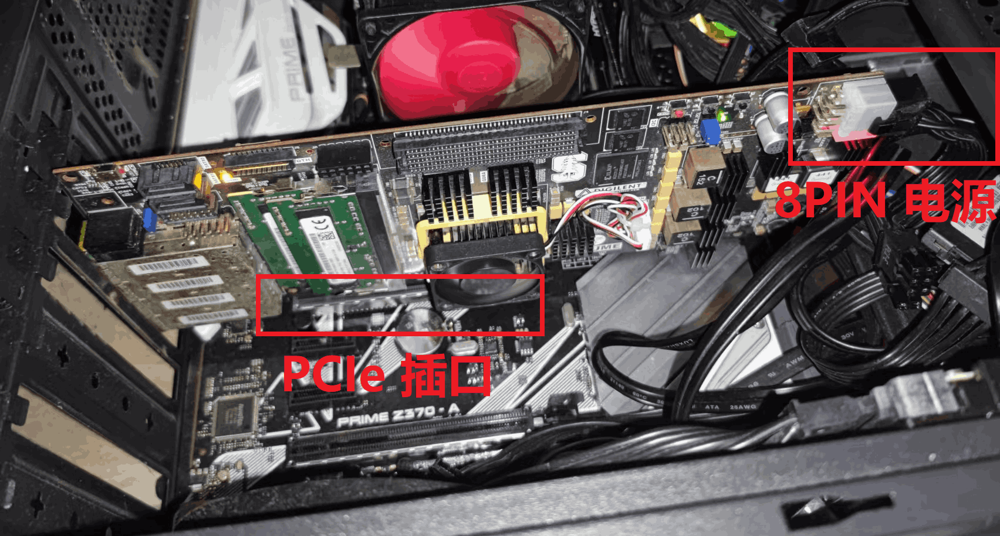

# FPGA 烧录流程

按照以下顺序操作：

- 确保主板完全断电，把 FPGA 插到该 Linux Host-PC 的 PCIe 插槽中。
  - 注意：由于 NetFPGA 的功耗比较大，无法直接使用 PCIe 插槽的电源，因此还需要插上它右上角的 8-PIN 电源（主机机箱里一般就有这个电源）
- 启动 Linux 主机，此时 FPGA 上电，但里面还没有烧录 bitstream 。我们用 Vivado 向其中烧录程序。
- 重启 Linux 主机，**注意一定要重启，而不是关机后再打开**。这是为了保证 FPGA 在整个过程中不会断电（不会丢失刚刚烧录的程序）

之所以要进行这个步骤，是因为 PCIe 的识别是在计算机启动时进行的，而不支持热插拔，我们需要重启来让计算机识别 PCIe。

:warning: 如果你要重新烧录 FPGA 程序，则也需要重启 Linux 来让它识别新的 FPGA 程序。

　



　

## 查看 PCIe XDMA 设备是否被识别

Linux 重启后，运行 `lspci` 命令来看看 PCIe 设备是否被正常识别。如果发现其中有 "Memory controller: Xilinx..." ，说明识别成功。

```bash
$ lspci
...                                                             # 其它 PCI 设备
01:00.0 Memory controller: Xilinx Corporation Device 7021       # Xilinx PCIe-XDMA 设备
...                                                             # 其它 PCI 设备
```

　