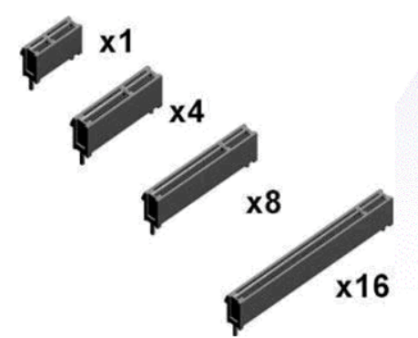

# PCIe 简介

PCIe (PCI Express) 是一种差分信号对的高速外设总线。目前具有五代 (Gen 1 \~ Gen 5) 、4种总线宽度 (x1, x4, x8, x16) 。

例如， PCIe Gen 2 x4 具有 4 对 TX 差分线和 4 对 RX 差分线，每对差分线的频率为 5GHz (提供 5Gb/s 的传输速率) ，则其理论带宽为 5Gb/s × 4 × （1-20%) = 16 Gb/s = 2 GB/s ，其中 20% 是由于底层协议的编码而引起的带宽浪费率 (该编码用于时钟恢复) 。

​     *表* : *PCIe 代、总线宽度和速率的关系*

|            代            | PCIe Gen 1 | PCIe Gen 2 | PCIe Gen 3 |
| :----------------------: | :--------: | :--------: | :--------: |
|       差分信号频率       |  2.5 GHz   |   5 GHz    |   8 GHz    |
|         编码方案         |   8b/10b   |   8b/10b   | 128b/130b  |
| 编码引起的带宽浪费率 (%) |    20 %    |    20 %    |   1.5 %    |
|      理论带宽 (x1)       | 0.25 GB/s  |  0.5 GB/s  | 0.984 GB/s |
|      理论带宽 (x4)       |   1 GB/s   |   2 GB/s   | 3.93 GB/s  |
|      理论带宽 (x8)       |   2 GB/s   |   4 GB/s   | 7.87 GB/s  |
|      理论带宽 (x16)      |   4 GB/s   |   8 GB/s   | 15.7 GB/s  |

|  |
| :---------------------------------------: |
|       **图** : 不同宽度的 PCIe 插槽       |

　

## RC 和 EP

PCIe 设备分为 **RC** 和 **EP** (endpoint) ，RC 设备也称为 PCIe-host ，例如计算机主板。 EP 设备也称为 PCIe-device ，例如显卡、FPGA开发板。 RC 和 EP 可以对插； RC 和 RC 之间、 EP 和 EP 之间则不能。

　

## 兼容性

不同代的 RC 对 EP 具有双向兼容性，例如 PCIe Gen 2 的 RC 可以插 PCIe Gen 1 的 EP ，也可以插 PCIe Gen 3 的 EP 。通信速率取二者的最小值。

RC 插槽兼容比它窄的 EP ，例如 x16 的插槽兼容 x1, x4, x8, x16 的 EP 。通信速率取二者中的最小值。

但 RC 插槽不兼容比它宽的 EP ，例如 x1 的插槽就不能插入 x4 的 EP 。