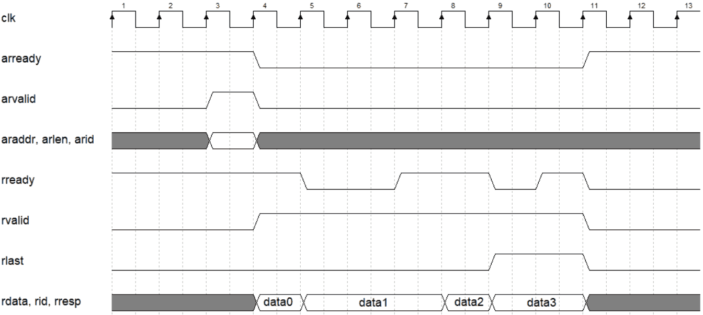
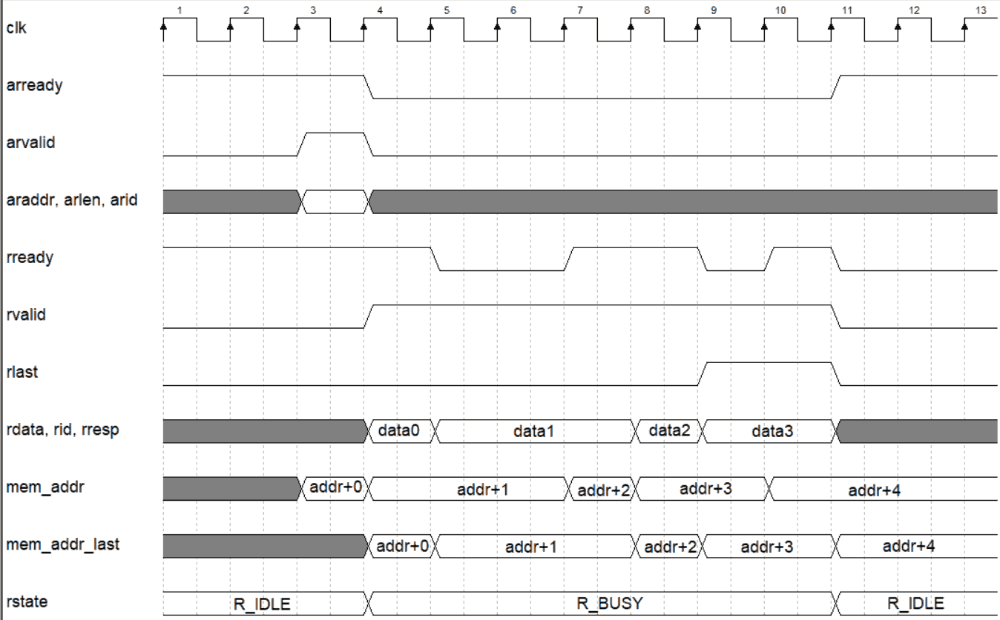
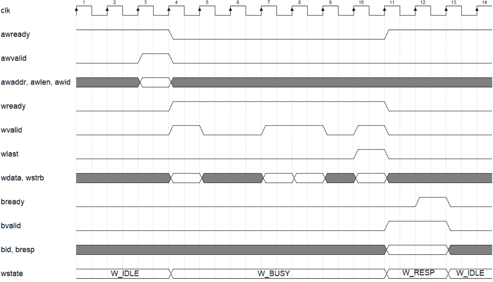

# 基于 Verilog 的 PCIe BRAM 读写工程

该例程对应的 Vivado 工程在 [netfpga_pcie_x1_xdma_bram.zip](../netfpga_pcie_x1_xdma_bram.zip) 中。

该例程的结构框图如下图。其中包括：

- 一个用传统 IP 例化方式例化的 **PCIe-XDMA** IP核；
- 一个用 Verilog 编写的 **AXI-BRAM** IP核；
- 编写 Verilog 将以上二者连接起来。整体而言实现了一个 PCIe 内存设备；
- 在 Host-PC 上编写 C 语言程序去读写它。

```
|------------|            |---------------------------------------------------------------|
|            |            |                                                               |
|            |            |    |---------------|                  |-------------------|   |
|            |            |    |               |                  |                   |   |
|   run      |    PCIe    |    |   PCIe-XDMA   |       AXI4       |   AXI-BRAM        |   |
|  C/C++     |<---------->|<-->|    IP core    |<---------------->|   (AXI-slave)     |   |
|  software  |            |    |               |Master       Slave|                   |   |
|            |            |    |  (AXI-master) | Port        Port |                   |   |
|            |            |    |---------------|                  |-------------------|   |
|            |            |                                                               |
|------------|            |---------------------------------------------------------------|
  Host-PC                                                      FPGA
                 图 : PCIe-XDMA + AXI-BRMA 实现 PCIe 内存设备
```

　

## 工程概览

打开 Vivado 工程在 [netfpga_pcie_x1_xdma_bram](../netfpga_pcie_x1_xdma_bram) ，可以看到它的文件结构如下：

- 设计文件 (Design Sources)
  - **fpga_top.sv** (FPGA顶层)
    - **xdma_0** (PCIe-XDMA IP)
    - **axi_bram.sv** (用 Verilog 编写的 AXI-BRAM slave IP)
- 约束文件 (Constraints)
  - **fpga_top.xdc** 

　

> :point_right: 关于 SystemVerilog
>
> .sv 是 SystemVerilog 的代码文件后缀，相比于 Verilog 多了一些方便的语法，但差别不大 (比 C 和 C++ 的差别小得多) 。如果你熟悉 Verilog 语法，可以直接阅读 SystemVerilog ，几乎不会存在障碍。
>
> 在 Vivado 中，SystemVerilog 和 Verilog 的模块之间可以交叉调用。

　

## 理解 AXI 总线

理解本工程的关键在于理解 AXI 总线的信号和时序，并编写 **axi_bram.sv** (一个简单的 AXI-slave) 。

关于 AXI 总线的更详细的信息详见 [AXI协议中文规范](https://github.com/lizhirui/AXI_spec_chinese) 。这里只进行简单的介绍。

AXI 是**纯同步**的总线，所有信号都需要在时钟 `clk` 的上升沿进行改变和采样。一个信号如果在第 n 个时钟上升沿被改变为新值，那么采样者只能在第 n+1 个时钟上升沿采样到这个新值。

**fpga_top.sv** 中将 **xdma_0** 和 **axi_bram.sv** 中的 AXI 信号连接起来。其中 **xdma_0** 是 AXI-master, **axi_bram** 是 AXI-slave 。在 AXI-slave 的视角下，AXI 的所有信号如下：

```verilog
    // AXI-MM AW interface ----------------------------------------------------
    output wire                        s_axi_awready,
    input  wire                        s_axi_awvalid,
    input  wire   [    AXI_AWIDTH-1:0] s_axi_awaddr,
    input  wire   [               7:0] s_axi_awlen,
    input  wire   [   AXI_IDWIDTH-1:0] s_axi_awid,
    // AXI-MM W  interface ----------------------------------------------------
    output wire                        s_axi_wready,
    input  wire                        s_axi_wvalid,
    input  wire                        s_axi_wlast,
    input  wire   [    AXI_DWIDTH-1:0] s_axi_wdata,
    input  wire   [(AXI_DWIDTH/8)-1:0] s_axi_wstrb,
    // AXI-MM B  interface ----------------------------------------------------
    input  wire                        s_axi_bready,
    output wire                        s_axi_bvalid,
    output wire   [   AXI_IDWIDTH-1:0] s_axi_bid,
    output wire   [               1:0] s_axi_bresp,
    // AXI-MM AR interface ----------------------------------------------------
    output wire                        s_axi_arready,
    input  wire                        s_axi_arvalid,
    input  wire   [    AXI_AWIDTH-1:0] s_axi_araddr,
    input  wire   [               7:0] s_axi_arlen,
    input  wire   [   AXI_IDWIDTH-1:0] s_axi_arid,
    // AXI-MM R  interface ----------------------------------------------------
    input  wire                        s_axi_rready,
    output wire                        s_axi_rvalid,
    output wire                        s_axi_rlast,
    output reg    [    AXI_DWIDTH-1:0] s_axi_rdata,
    output wire   [   AXI_IDWIDTH-1:0] s_axi_rid,
    output wire   [               1:0] s_axi_rresp 
```

　

可以看出，AXI 分为 5 个通道。其中以下 3 个通道用来写数据 （数据从 AXI-master 流向 AXI-slave）：

- 写地址 (AXI Write Address Channel, 简称 **AW**) ：AXI-master 告诉 AXI-slave 要写的首地址、长度、ID 等信息
- 写数据 (AXI Write Data Channel, 简称 **W**) ：AXI-master 向 AXI-slave 传送数据
- 写响应 (AXI Write Response Channl, 简称 **B**) : 在收到数据后， AXI-slave 向 AXI-master 响应

以下 2 个通道用来读数据 （数据从 AXI-slave 流向 AXI-master）：

- 读地址 (AXI Read Address Channel, 简称 **AR**) ：AXI-master 告诉 AXI-slave 要读的首地址、长度、ID 等信息
- 读数据 (AXI Read Data Channel, 简称 **R**) ：AXI-slave 向 AXI-master 传送数据

AXI 进行的是 burst 操作，也即指定一个读/写地址和长度 len ，然后以这个地址为起始地址，传送 len 字节的数据。

下面我们分析 AXI 读和写的时序，讲解 **axi_bram.sv** 中的 AXI-slave 的状态机的编写思路。

　

### 读通道时序

|                     |
| :--------------------------------------------------------: |
| **图1**：AXI 读时序 (本例中读长度=4，W通道上进行了4次握手) |

如**图1**是 AXI 读时序。分为两个步骤：

- **AR通道握手**：在 AR 通道上握手并传送读地址、长度、ID ： 
  - AXI-master 控制 arvalid 信号, AXI-slave 控制 arready 信号。
  - 当任何一方没有准备好时，需要让自己控制的信号 =0 。
  - 当 AXI-master 让 arvalid=1 时，必须确保 araddr, arlen, arid 上出现有效的读地址、长度、ID
  - arlen+1 才是要读的数据长度，例如 arlen=7 ，那么实际上要传送 8 次数据。 
  - 只有当 arready 和 arvalid 都是 1 时，握手成功。
  - 握手成功时，AXI-slave 采样 araddr, arlen, arid ，开始向 AXI-master 传送读数据。
- **R通道握手**：在 R 通道上握手并传送数据、ID 、响应状态
  - AXI-master 控制 rready 信号, AXI-slave 控制 rvalid 信号。
  - 当任何一方没有准备好时，需要让自己控制的信号 =0 。
  - 当 AXI-slave 让 rvalid=1 时，必须确保 rdata, rid, rresp 上出现有效的数据、ID、响应类型
  - 只有当 rready 和 rvalid 都是1 时，一次握手成功
  - 握手成功时，AXI-master 采样 rdata, rid, rresp 。
  - AXI-slave 一共要传送 (arlen+1) 次数据，在传送最后一个数据时，需要让 rlast=1 。
  - 在 (arlen+1) 次握手后，AXI-slave 停止传送数据。本次 AXI 读会话结束。

基于以上，编写 AXI-slave 端的状态机如下。

注意 `rstate` 是状态机变量，它只有两个状态：

- `R_IDLE` 代表 AXI-slave 空闲，正在等待 AR 通道上的握手，握手成功后跳转到 `R_BUSY` 状态。
- `R_BUSY` 代表 AXI-slave 正在传送数据，不断等待 R 通道上的握手。当最后一个数据传送完后，跳转到 `R_IDLE` 状态。

```verilog
// 以下代码摘自我编写的 axi_bram.sv 的58行 -----------------------------------------------
enum reg [0:0] {R_IDLE, R_BUSY} rstate = R_IDLE;

reg  [AXI_IDWIDTH-1:0] rid = '0;
reg  [            7:0] rcount = '0;

assign s_axi_arready = (rstate == R_IDLE);                      // 空闲
assign s_axi_rvalid  = (rstate == R_BUSY);                      // 正在传送数据
assign s_axi_rlast   = (rstate == R_BUSY) && (rcount == 8'd0);  // 正在传送最后一个数据
assign s_axi_rid     = rid;                                     // 把从 s_axi_arid 采样到的 rid 反馈给主机
assign s_axi_rresp   = '0;                                      // 响应类型：0 代表 AXI-slave 正常响应

always @ (posedge clk or negedge rstn)
    if (~rstn) begin
        rstate <= R_IDLE;
        rid    <= '0;
        rcount <= '0;
    end else begin
        case (rstate)
            R_IDLE :
                if (s_axi_arvalid) begin
                    rstate <= R_BUSY;
                    rid    <= s_axi_arid;                    // 从 s_axi_arid 采样到 rid
                    rcount <= s_axi_arlen;                   // 从 s_axi_arlen 采样到 rcount
                end
            R_BUSY :
                if (s_axi_rready) begin
                    if (rcount == 8'd0)                      // the last data of read session
                        rstate <= R_IDLE;                    // back to R_IDLE
                    rcount <= rcount - 8'd1;
                end
        endcase
    end
```

### 读通道地址的处理

有了以上状态机，我们还要正确的处理地址，这个地址要提供给 (后续我们要编写的) BRAM ，这部分相对难以理解。

考虑 BRAM 具有 1 周期的读延迟 (read latency) ，也即给出 BRAM 地址后，BRAM 在下一周期才能给出数据，因此我们要提前一周期准备要读的数据的地址。代码如下，其中 `mem_raddr` 是要提供给 BRAM 的地址，而 `mem_raddr_last` 是 `mem_raddr` 打一拍 (延迟一个周期) ：

```verilog
// 以下代码摘自我编写的 axi_bram.sv 的92行 -----------------------------------------------
reg  [ MEM_AWIDTH-1:0] mem_raddr, mem_raddr_last;

always @ (*)                                             // 为了能提前一周期给出地址，这里要用组合逻辑!
    if      (rstate == R_IDLE && s_axi_arvalid)
        mem_raddr = (MEM_AWIDTH)'(s_axi_araddr >> log2(AXI_DWIDTH/8));
    else if (rstate == R_BUSY && s_axi_rready)
        mem_raddr = mem_raddr_last + (MEM_AWIDTH)'(1);
    else
        mem_raddr = mem_raddr_last;

always @ (posedge clk)
    mem_raddr_last <= mem_raddr;
```

为了便于理解以上代码，我们把 `mem_addr` 和 `mem_addr_last` 的波形放在 AXI 波形中来看，如**图2 **。其思路如下：

- 当 `rstate==R_IDLE && s_axi_arvalid==1` 时，如果 AR 通道握手成功。此时我们立即 (无延迟地) 让 `mem_raddr = s_axi_araddr>>(AXI数据线的字节宽度)` 。这样，我们就能确保下一周期就能从 BRAM 中拿出第一个数据（也即 addr+0 对应的数据）
  - **注意**：`s_axi_araddr` 是字节地址，而这里我们让  `mem_addr` 和 `mem_addr_last` 上的地址是一个数据单元（=AXI总线宽度）的地址，例如 AXI 总线宽度是 64bit (8字节) ，那么这里  `mem_addr` 和 `mem_addr_last`  就是 8 字节地址，把字节地址右移动 3 位就能得到。
- 当 `rstate == R_BUSY && s_axi_rready=1` 时，说明 R 通道握手成功，当前数据已经成功被 AXI-master 接收了。此时我们立即 (无延迟地) 让 `mem_raddr+1` ，确保下一周期就能从 BRAM 中拿出下一个数据 。
- 其它情况下，让 `mem_raddr = mem_raddr_last` ，因为 `mem_raddr_last`  就是 `mem_raddr` 在上一周期的值，这样做就是让 `mem_raddr` 与上一周期相同，保持不变。

|  |
| :-----------------------------------------: |
|       **图2**：AXI 读过程中的地址处理       |

　

### 写通道时序

|  |
| :---------------------------------------: |
|            **图3**：AXI 写时序            |

如**图3**是 AXI 写时序。分为三个步骤：

- **AW通道握手**：在 AW 通道上握手并传送读地址、长度、ID ： 
  - AXI-master 控制 awvalid 信号, AXI-slave 控制 awready 信号。
  - 当任何一方没有准备好时，需要让自己控制的信号 =0 。
  - 当 AXI-master 让 awvalid=1 时，必须确保 awaddr, awlen, awid 上出现有效的读地址、长度、ID
  - awlen+1 才是要写的数据长度，例如 awlen=7 ，那么实际上要传送 8 次数据。 
  - 只有当 awready 和 awvalid 都是 1 时，握手成功。
  - 握手成功时，AXI-slave 采样 awaddr, awlen, awid ，开始接收 AXI-master 传来的写数据。
- **W通道握手**：在 W 通道上握手并传送数据、ID 、响应状态
  - AXI-master 控制 wvalid 信号, AXI-slave 控制 wready 信号。
  - 当任何一方没有准备好时，需要让自己控制的信号 =0 。
  - 当 AXI-master 让 wvalid=1 时，必须确保 wdata, wstrb 上出现有效的写数据、独热码 (独热码的用途将在后续讲解)
  - 只有当 wready 和 wvalid 都是1 时，一次握手成功
  - 握手成功时，AXI-slave 采样 wdata, wstrb 。
  - AXI-master 一共要传送 (awlen+1) 次数据，在传送最后一个数据时，需要让 wlast=1 。
  - 在 (awlen+1) 次握手后，AXI-slave 停止传送数据。
- **B通道握手**：在 B 通道上进行一次握手，代表 AXI-slave 向 AXI-master 响应 "本次写成功"
  - AXI-master 控制 bready 信号, AXI-slave 控制 bvalid 信号。
  - 当任何一方没有准备好时，需要让自己控制的信号 =0 。
  - 当 AXI-slave 让 bvalid=1 时，必须确保 bid, bresp 上出现有效的 ID 和响应类型。
  - 握手成功时，AXI-master 采样 bid, bresp 。本次 AXI 写会话结束。

基于以上，编写 AXI-slave 端的状态机如下。

注意 `wstate` 是状态机变量，它有三个状态：

- `W_IDLE` 代表 AXI-slave 空闲，正在等待 AW 通道上的握手，握手成功后跳转到 `W_BUSY` 状态。
- `W_BUSY` 代表 AXI-slave 正在接受数据，不断等待 W 通道上的握手。当最后一个数据传送完后，或者当 `wlast=1` 时，跳转到 `W_RESP` 状态。
-  `W_RESP` 代表 AXI-slave 正在发起响应，不断等待 B 通道上的握手。握手成功后，恢复到 `W_IDLE` 状态

```verilog
// 以下代码摘自我编写的 axi_bram.sv 的 109 行 -----------------------------------------------

enum reg [1:0] {W_IDLE, W_BUSY, W_RESP} wstate = W_IDLE;

reg  [AXI_IDWIDTH-1:0] wid = '0;
reg  [            7:0] wcount = '0;
reg  [ MEM_AWIDTH-1:0] mem_waddr = '0;

assign s_axi_awready = (wstate == W_IDLE);                      // 空闲
assign s_axi_wready  = (wstate == W_BUSY);                      // 正在接受数据
assign s_axi_bvalid  = (wstate == W_RESP);                      // 正在发起响应
assign s_axi_bid     = wid;                                     // 把从 s_axi_awid 采样到的 wid 反馈给主机
assign s_axi_bresp   = '0;                                      // 响应类型：0 代表 AXI-slave 正常响应

always @ (posedge clk or negedge rstn)
    if (~rstn) begin
        wstate <= W_IDLE;
        wid <= '0;
        wcount <= '0;
        mem_waddr <= '0;
    end else begin
        case (wstate)
            W_IDLE :
                if (s_axi_awvalid) begin
                    wstate <= W_BUSY;
                    wid <= s_axi_awid;
                    wcount <= s_axi_awlen;
                    mem_waddr <= (MEM_AWIDTH)'(s_axi_awaddr >> log2(AXI_DWIDTH/8));    // 保存要写的首地址
                end
            W_BUSY :
                if (s_axi_wvalid) begin
                    if (wcount == 8'd0 || s_axi_wlast)
                        wstate <= W_RESP;
                    wcount <= wcount - 8'd1;
                    mem_waddr <= mem_waddr + (MEM_AWIDTH)'(1);                         // 每完成一次握手，地址 +1
                end
            W_RESP :
                if (s_axi_bready)
                    wstate <= W_IDLE;
            default :
                wstate <= W_IDLE;
        endcase
    end
```

写通道虽然状态更多，但地址的处理更简单，只需要：

- 在 AW 通道握手成功时，保存要写的首地址
- 在 W 通道每次握手成功时，让地址 +1 ，

　

## 编写 BRAM 

以上，我们编写了状态机正确地处理了 AXI-slave 的总线时序，下一步就要编写 BRAM 的 "本体"

在 Xilinx FPGA 中，调用 BRAM 的方式有很多，大多数人熟悉的方式是使用 **Block RAM Generator** 这个 IP 。然而我强烈推荐**直接编写 Verilog reg 数组来例化 BRAM** ，它的有点有：

- **移植性强** : 不需要任何修改，就能移植到各种 FPGA 开发工具中（例如 Xilinx Vivado, Intel Quartus, Microsemi Libero) 。
- **可参数化** : 可以很方便的用 Verilog 的 \`define 或 parameter 来控制 BRAM 的位宽和深度。当需要修改 BRAM 位宽和深度时，直接修改参数即可， 不需要重新生成 IP 。
- **代码量小** : 只需要严格遵守下述写法，不需要多少 Verilog 代码量，就能实现一个 BRAM 。

　

### 无 "写独热码" 的写法

需要遵循以下写法，来让一个 Verilog 中的 reg 数组综合成 BRAM ：

``` verilog
// 遵循以下写法，就能让 reg 二位数组综合成 BRAM 
reg [位宽-1:0] mem [深度-1:0];         // reg 二维数组
reg [位宽-1:0] mem_rdata;             // 读BRAM的数据会出现在该变量上。

always @ (posedge clk)               // 读 BRAM ，该 always 块不能加异步复位
    mem_rdata <= mem[读地址];         // 不能加任何读条件 （if 条件），任何周期都给地址，并在下一周期读处数据到 mem_rdata 变量上

always @ (posedge clk)               // 写 BRAM ，该 always 块不能加异步复位
    if (写使能条件)                    // 写使能条件，可以是简单的 1-bit 信号，也可以是比较复杂的逻辑表达式
        mem[写地址] <= 要写的数据;      // 
```

之所以要遵循以上写法，是因为 BRAM 是 FPGA 中的固定硬件块，其行为是固定的（“死板”地遵循上述代码的写行为和读行为），如果不遵循以上写法，综合工具会发现该 reg 数组无法综合成 BRAM ，就只能综合成真正的寄存器数组，非常耗费资源。

　

### 有 "写独热码" 的写法

有时候我们需要有 “写独热码” 功能的 BRAM 。**独热码** 用来控制数据的部分写入。一个典型的场景是： BRAM 的 wdata 位宽是 8 bit （1字节）的倍数，例如 32 bit （4字节），则独热码 wstrb 有 4 bit，如果我们不想同时写入 4 个字节，而是只写入该地址中的一部分字节，就要用独热码来控制：

- wstrb[0]=1 代表 wdata[7:0] 要写入， =0 代表 wdata[7:0] 不能写入
- wstrb[1]=1 代表 wdata[15:8] 要写入， =0 代表 wdata[15:8] 不能写入
- 以此类推……

我们需要遵循以下写法来实现一个 有 "写独热码" 的 BRAM。

```verilog
// 遵循以下写法，就能让 reg 二位数组综合成有 "写独热码" 的 BRAM
reg [位宽-1:0] mem [深度-1:0];         // reg 二维数组
reg [位宽-1:0] mem_rdata;             // 读BRAM的数据会出现在该变量上。

always @ (posedge clk)               // 读 BRAM ，该 always 块不能加异步复位
    mem_rdata <= mem[读地址];         // 不能加任何读条件 （if 条件），任何周期都给地址，并在下一周期读处数据到 mem_rdata 变量上

always @ (posedge clk)               // 写 BRAM ，该 always 块不能加异步复位
    if (写使能条件) begin              // 写使能条件，可以是简单的 1-bit 信号，也可以是比较复杂的逻辑表达式
        if (wstrb[0])
            mem[写地址][ 7: 0] <= 要写的数据[ 7: 0];
        if (wstrb[1])
            mem[写地址][15: 8] <= 要写的数据[15: 8];
        if (wstrb[2])
            mem[写地址][23:16] <= 要写的数据[23:16];
    end
```

　

按照上述写法，编写 **axi_bram.sv** 中的 BRAM 如下。

```verilog
reg [AXI_DWIDTH-1:0] mem [ 1<<MEM_AWIDTH ];

always @ (posedge clk)                           // 读 BRAM
    s_axi_rdata <= mem[mem_raddr];

always @ (posedge clk)                           // 写 BRAM
    if (s_axi_wvalid & s_axi_wready)             // 写条件 = AXI 的 W 通道上握手成功
        for (int i=0; i<(AXI_DWIDTH/8); i++)
            if (s_axi_wstrb[i])
                mem[mem_waddr][i*8+:8] <= s_axi_wdata[i*8+:8];
```

注意：

- 这里写了一个 **for循环** 来简化独热码的写法（否则我们要写很多个 if）
- 读 BRAM 没有读条件。你可能会好奇：AXI 不是只在 R 通道握手成功时读吗，那么 BRAM 没有读条件会不会有什么影响？。实际上并不会，因为它每周期都读出数据，而 AXI-master 只在握手成功时从 `s_axi_rdata` 信号上拿走数据，而其它的读数据相当于扔掉了。

　

　

## 后续步骤

- 对该工程进行 综合 (Synthesis) 、实现 (implementation) 、生成比特流 (Generate bitstream)。
- 插入 PCIe 并烧录 FPGA。详见 [FPGA_plug_and_writebitstream.md](./FPGA_plug_and_writebitstream.md)
- 在 Linux 主机上加载 PCIe XDMA 的驱动。详见 [load_xdma_driver.md](./load_xdma_driver.md)
- 运行C语言程序进行读写测试。详见 [run_software_xdma_bram.md](./run_software_xdma_bram.md)

